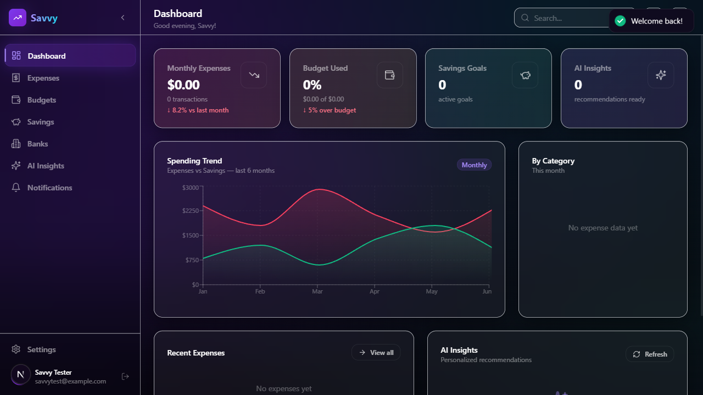
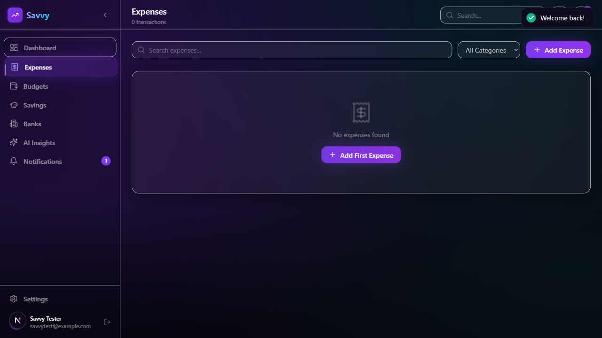
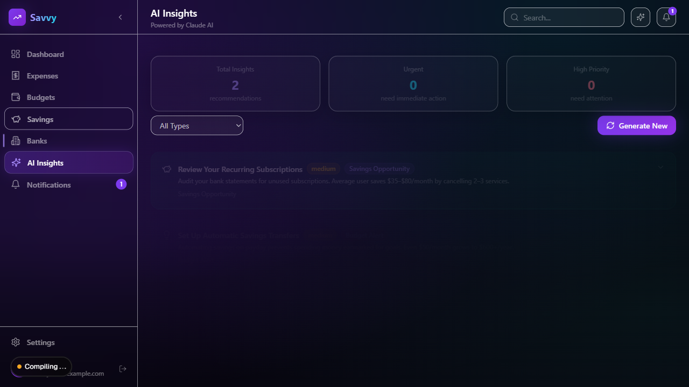
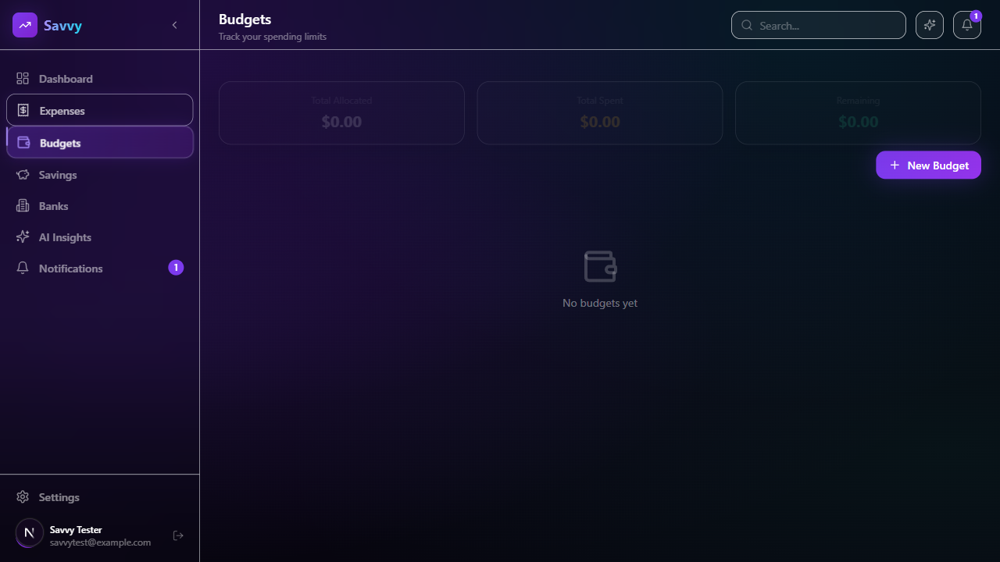
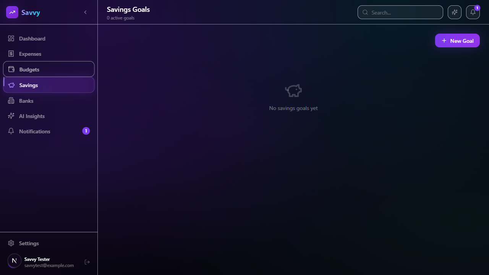
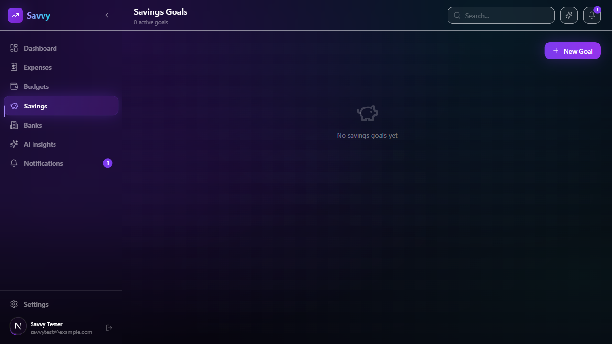

<div align="center">

# 🕌 Savvy
### AI-Powered Islamic Financial Management System

*"What if your money app actually understood your faith?"*

[](https://fastapi.tiangolo.com)
[](https://nextjs.org)
[](https://python.org)
[](https://postgresql.org)
[](https://docker.com)
[](https://kafka.apache.org)
[](https://anthropic.com)
[](LICENSE)

</div>

---

## The Problem

Every mainstream finance app — Mint, YNAB, Money Manager — is built for a secular Western user. No Zakat calculator. No Qurbani planner. No Riba warnings. No Sadaqah tracker. No Hajj savings goals.

**For 1.8 billion Muslims, there's a gap between religious obligation and personal finance tooling.**

Savvy closes that gap — without sacrificing engineering quality.

---

## Screenshots

<div align="center">

| Dashboard | Expenses | AI Insights |
|:---------:|:--------:|:-----------:|
|  |  |  |

| Budgets | Savings | Banks |
|:-------:|:-------:|:-----:|
|  |  |  |

</div>

---

## Features

### 💰 Core Finance
| Feature | Description |
|---------|-------------|
| **Expense Tracking** | 13 categories, monthly trends, soft-delete |
| **Budget Management** | Per-category monthly budgets; 80% threshold alerts via Kafka |
| **Spending Limits** | Daily / weekly / monthly limits with real-time remaining |
| **Savings Goals** | Target + deadline; full deposit/withdrawal history |
| **Asset Portfolio** | 7 asset classes (stocks, crypto, real estate, commodities); P&L analytics |
| **Liabilities & Net Worth** | Live net worth = assets − liabilities; Riba flagging |
| **Cash Savings** | Track physical cash with labels, currency, and location |

### 🕌 Islamic Finance (The Differentiator)
| Feature | Description |
|---------|-------------|
| **Zakat Calculator** | Gold nisab (87.48g) + silver nisab (612.36g); marks paid; auto-feeds Health Score |
| **Qurbani Planner** | Cow/goat share pricing by currency; contribution deposit tracking |
| **Sadaqah Tracker** | 7 giving categories: sadaqah, lillah, waqf, fidya, kaffarah, zakat_fitrah, general; 12-month trend |
| **Hajj / Umrah Savings** | Multi-person plans; 4 package tiers; monthly target auto-calculation |
| **Riba Detection** | `is_interest_bearing` flag on every liability; penalises Debt Ratio in Health Score |
| **Islamic Health Score** | A–F grade across 6 components: Savings Rate (25pts) · Budget Adherence (20pts) · Debt Ratio (20pts) · Zakat Compliance (15pts) · Charitable Giving (10pts) · Goal Progress (10pts) |

### 🤖 AI Features
| Feature | Description |
|---------|-------------|
| **Statement Analysis** | Upload PDF/CSV/XLSX → Claude extracts + categorises every transaction with confidence scores |
| **AI Recommendations** | LangGraph multi-step workflow → personalised financial advice from Claude |
| **Context-Aware Advice** | Spending patterns + savings rate + debt ratio + goals all feed into AI context |
| **RAG Memory** | Per-user ChromaDB collections store financial history for personalised recommendations |

### 🔔 Notifications
- In-app notification centre with unread count
- Email via SMTP (optional)
- Push notifications via OneSignal (optional)
- 60-second dedup window — no spam
- 30-day auto-expire

---

## Architecture

```
┌──────────────────────────────────────────────────────────────┐
│                    [Next.js 14  :3000]                       │
│              Zustand · Recharts · Framer Motion              │
└────────────────────────┬─────────────────────────────────────┘
                         │ HTTPS  (gateway-net)
                         ▼
┌──────────────────────────────────────────────────────────────┐
│               [API Gateway  :8000]                           │
│   JWT auth · Rate limiting · HMAC signing · Security headers │
└────────┬──────────────────────────────────────────┬──────────┘
         │         internal-net                     │
    ┌────┴──────────────────────────────────────┐   │
    │                                           │   │
    ▼                                           ▼   ▼
[User Service :8001]          [Finance Service :8002]
 Registration · MFA · JWT      Expenses · Budgets · Savings
 PostgreSQL · Redis · Kafka     Zakat · Qurbani · Sadaqah
                                Hajj · Net Worth · Health Score
                                PostgreSQL (RLS) · Redis · Kafka

[Bank Service :8003]          [Statement Analysis :8004]
 Bank accounts                 PDF/CSV/XLSX parsing
 Statement upload              Claude AI extraction
 AWS S3 storage                Transaction categorisation
 PostgreSQL · Kafka            ChromaDB · Redis · S3

[AI Recommendation :8005]     [Notification Service :8006]
 LangGraph workflow            In-app · Email · Push
 Claude AI advisor             Dedup · Auto-expire
 ChromaDB (per-user)          PostgreSQL · Redis · Kafka
 Redis cache (1h TTL)
```

**Network topology:** 6 isolated Docker networks. DB containers have `internal: true` — a compromised microservice cannot reach another service's database.

---

## Security

34 security features catalogued, tracked, and implemented across every layer.

| Layer | What's Implemented |
|-------|--------------------|
| **Auth** | MFA/TOTP · Refresh token rotation (UUID jti, one-time-use) · Concurrent session cap (5 max) · Token versioning (immediate invalidation on password change) · Account lockout after 5 failures |
| **Transport** | HMAC-SHA256 request signing between services (±30s replay window) · HTTP security headers (CSP, HSTS, X-Frame-Options…) · mTLS dev cert generation script |
| **Database** | PostgreSQL Row-Level Security on all 11 finance tables — DB refuses cross-user queries even if ORM is bypassed |
| **AI** | 14-pattern prompt injection sanitiser · PDF injection stripping · System prompt anti-disclosure · Output PII scan · Feedback bot detection · Per-user ChromaDB isolation |
| **Infrastructure** | Non-root containers (UID 1001) · 6-network segmentation · Secrets rotation with dual-validity window |
| **CI/CD** | pip-audit · bandit static analysis · npm audit · Trivy image scanning → GitHub Security tab (weekly + every push) |

```
🔴 Critical:  8 done · 3 partial · 1 deferred (K8s Secrets)
🟡 High:      9 done · 1 partial · 0 remaining
🟢 Medium:    5 done · 0 partial · 0 remaining
⚪ Low:       2 done · 0 partial · 0 remaining
```

See [`SECURITY_FEATURES.md`](SECURITY_FEATURES.md) for full catalogue with implementation details.

---

## Tech Stack

### Backend


### AI & Data
-D97706?style=flat-square)


### Frontend


### DevOps


---

## Quick Start

### Prerequisites
- Docker + Docker Compose
- Anthropic API key ([console.anthropic.com](https://console.anthropic.com))

### Run Locally

```bash
# 1. Clone
git clone https://github.com/muhammadsufiyanbaig/savvy.git
cd savvy

# 2. Configure environment
cp microservices/.env.example microservices/.env
```

Edit `microservices/.env` — minimum required keys:

```env
SECRET_KEY=your-32-char-secret-key-here
FIELD_ENCRYPTION_KEY=your-32-char-encryption-key
ANTHROPIC_API_KEY=sk-ant-...
```

```bash
# 3. Start all 7 services
docker-compose -f microservices/docker-compose.yml up --build
```

| Service | URL |
|---------|-----|
| Frontend | http://localhost:3000 |
| API Gateway | http://localhost:8000 |
| Interactive API Docs | http://localhost:8000/docs |

### Generate secret keys

```bash
python -c "import secrets; print(secrets.token_hex(32))"
```

---

## Project Structure

```
savvy/
├── microservices/
│   ├── api-gateway/              # JWT auth, rate limiting, request routing
│   ├── user-service/             # Auth, MFA, profiles
│   ├── finance-service/          # Expenses, budgets, Zakat, Qurbani, Sadaqah, Hajj
│   ├── bank-service/             # Bank accounts, statement uploads (S3)
│   ├── statement-analysis-service/  # AI PDF/CSV/XLSX parsing (Claude)
│   ├── ai-recommendation-service/   # LangGraph + Claude recommendations
│   ├── notification-service/     # In-app, email, push notifications
│   ├── shared/                   # PII filter, service auth, common utils
│   ├── database/rls/             # PostgreSQL Row-Level Security scripts
│   └── docker-compose.yml
├── frontend/                     # Next.js 14 App Router
├── k8s/                          # Kubernetes manifests
├── scripts/                      # EKS setup, mTLS cert generation
├── .github/workflows/            # CI: tests, security scans, deploy
├── SECURITY_FEATURES.md          # 34-feature security catalogue
├── DEPLOYMENT_STRATEGY.md        # Production deployment guide
├── SRS_Document.md               # Full software requirements
└── PORTFOLIO.md                  # Engineering deep-dive
```

---

## Why This Is Not a Tutorial Project

| Tutorial project | Savvy |
|-----------------|-------|
| Single monolith | 7 independently deployable microservices |
| JWT in, JWT out | MFA + refresh rotation + session caps + token versioning |
| `SELECT * FROM expenses` | PostgreSQL RLS — DB refuses cross-user queries |
| One `claude.chat()` call | LangGraph multi-step workflow + injection sanitiser + PII scan + bot detection |
| Single Docker network | 6 isolated networks; DB containers unreachable by non-owning services |
| `print()` debugging | Structured PII-masking logging filter across all services |
| No CI | Weekly CVE scanning (Trivy + pip-audit + bandit) → GitHub Security tab |
| Money as `float` | `Numeric(15,2)` — because `0.1 + 0.2 ≠ 0.3` |

---

## Documentation

| Document | Description |
|----------|-------------|
| [`SRS_Document.md`](SRS_Document.md) | Full software requirements (17 feature groups, 60+ FR items) |
| [`SECURITY_FEATURES.md`](SECURITY_FEATURES.md) | 34-feature security catalogue with implementation details |
| [`DEPLOYMENT_STRATEGY.md`](DEPLOYMENT_STRATEGY.md) | Production deployment on EKS + Cloudflare |
| [`ENVIRONMENT_KEYS_GUIDE.md`](ENVIRONMENT_KEYS_GUIDE.md) | All environment variables documented |
| [`PORTFOLIO.md`](PORTFOLIO.md) | Engineering deep-dive for technical review |
| [`System_Architecture_Diagram.md`](System_Architecture_Diagram.md) | Full ASCII architecture diagram |

---

## Status

- ✅ **Module 1 — Core Platform:** Complete (all 17 functional requirement groups)
- ✅ **Security Hardening:** 30/34 features implemented
- ✅ **CI/CD Pipeline:** Security scans on every push + weekly schedule
- 🚧 **Production Deploy:** EKS manifests + scripts ready; pending cloud provisioning

---

<div align="center">

Built with ❤️ for the Muslim community · Powered by [Claude](https://anthropic.com) · Deployed on [AWS](https://aws.amazon.com)

</div>
